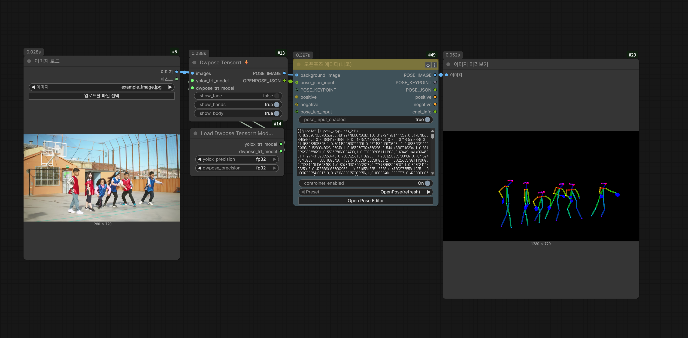
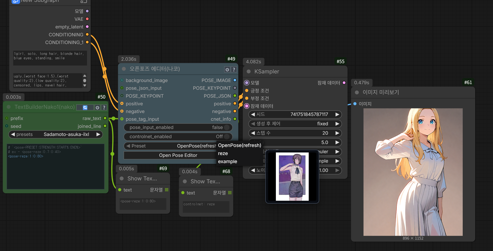
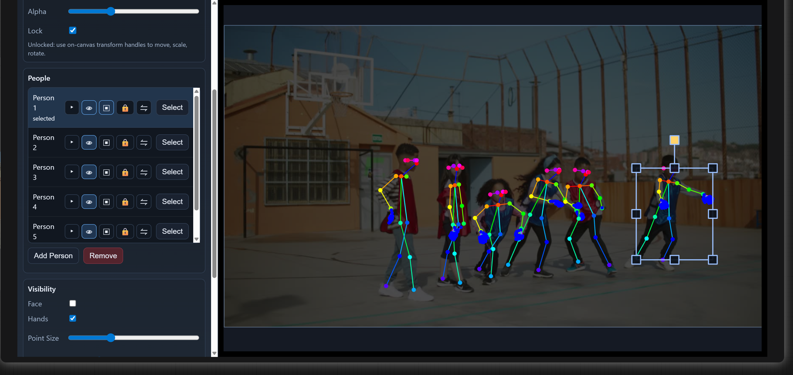
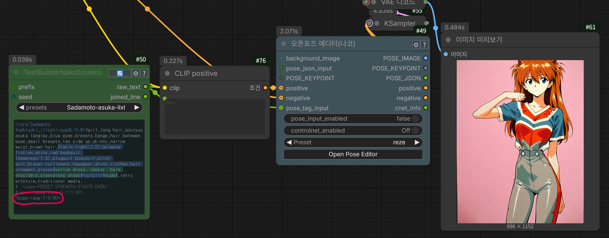

# ComfyUi_NakoNode

Custom node package for ComfyUI that provides an interactive OpenPose editor node with optional ControlNet conditioning.

## Representative Screenshots

### OverView





### Editor



## Features
- Interactive pose editor UI inside ComfyUI
- Outputs pose image, keypoints, and pose JSON
- Optional ControlNet apply flow from the same node
- Preset-based pose loading
- `pose_tag_input` parser: `<pose-PRESET:STRENGTH:START%:END%>`
- ex - <pose-standing:0.7:0:70>

## Requirements

- ComfyUI
- Python packages from `requirements.txt`:
  - `numpy`
  - `opencv-python`
  - `torch`
  - `matplotlib`

## Installation

1. Clone or copy this repository into your ComfyUI custom nodes directory:
   - `git clone https://github.com/nakoland/ComfyUi_NakoNode.git`
2. Navigate into the cloned folder and install dependencies in your ComfyUI environment:
   - `pip install -r ./requirements.txt`
3. Restart ComfyUI.

## Node

- Class name: `NakoOpenPoseEditor`
- Display name in UI: `OpenPose Editor(nako)`
- Category: `Nako/Pose`

## Basic Usage

1. Add `OpenPose Editor(nako)` to your workflow.
2. Open the editor from the node UI and build or adjust a pose.
3. Click **Send To Node** in the editor.
4. Use outputs:
   - `POSE_IMAGE` for ControlNet or preview pipelines
   - `POSE_KEYPOINT` to pass pose data between nodes
   - `POSE_JSON` for text-based pose workflows
5. If needed, connect `positive` and `negative` conditioning to let this node apply ControlNet directly.

## Inputs and Outputs

### Main optional inputs

- `background_image`: reference image in editor
- `POSE_JSON`: pose JSON text
- `POSE_KEYPOINT`: pose keypoint object
- `pose_json_input`: external JSON string input
- `pose_input_enabled`: switch for external pose input handling
- `positive`, `negative`: conditioning inputs
- `controlnet_enabled`: when `On`, applies pose ControlNet to `positive`/`negative` conditioning
- `controlnet_model`, `controlnet_strength`, `controlnet_start_percent`, `controlnet_end_percent`: configurable ControlNet values from the node `Settings (⚙)` popup
- Pose source/application priority: `pose_tag_input` > `pose_input_enabled` > `Preset`
- `pose_tag_input`: if a pose tag exists, ControlNet is applied by tag settings regardless of `controlnet_enabled`

### pose_tag_input



- The pose tag is one of the most useful features of this node.
- `pose_tag_input` automatically detects pose tags from the input text, allowing it to be used seamlessly within your prompts.
- By leveraging these features, it can be used not only with wildcards but also as a combined prompt + pose preset.
- `pose_tag_input` parser: `<pose-PRESET:STRENGTH:START:END>`
- Example: `<pose-standing:1.0>` uses preset `standing` (if it exists) and applies strength `1.0`; start/end use current settings.
- `<pose-...>` autocomplete is supported when `comfyui-custom-scripts (pysssss)` is installed.

## pose_tag_input Syntax

Format:

```text
<pose-PRESET_NAME:STRENGTH:START_PERCENT:END_PERCENT>
```

Examples:

```text
<pose-standing>
<pose-standing:1.0>
<pose-standing:0.9:0:70>
```

## Preset Files

- Pose preset file:
  - `Presets/openpose-preset.json`
- Pose preset thumbnail assets:
  - `Presets/openpose-preset.json.assets/`

## Editor Controls (Quick)

- `Space + Drag`: pan
- `Mouse Wheel`: zoom
- `Shift + Click`: multi-select points
- `Drag empty area`: rectangle select
- `Ctrl + Z`: undo
- `Delete`: hide selected point/group

## Notes

- If `controlnet_model` is `none` (or missing), ControlNet is not applied.
- When pose input is empty or invalid, the node falls back to a default pose.
- `PRESET_NAME` is loaded from `Presets/openpose-preset.json`.
- If a valid pose tag is provided, preset pose data is prioritized and ControlNet is applied even when `controlnet_enabled` is `Off`.
- Numeric values are optional; omitted fields keep current `Settings (⚙)` values.

## Support

If this project helps your workflow, thank you for using Nako Pose.
Your support helps ongoing maintenance and future updates.

- USDT (TRON / TRC20): `THdCx981bTQtnJ98dFyhmmspFNwxo9Uv2D`

Thank you so much for your support.

